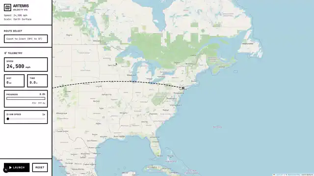
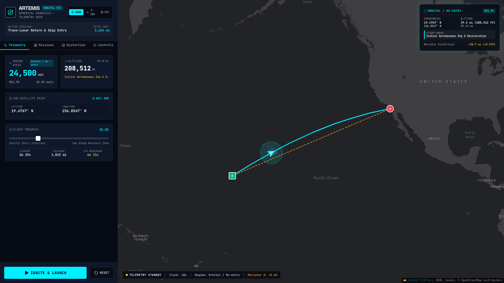
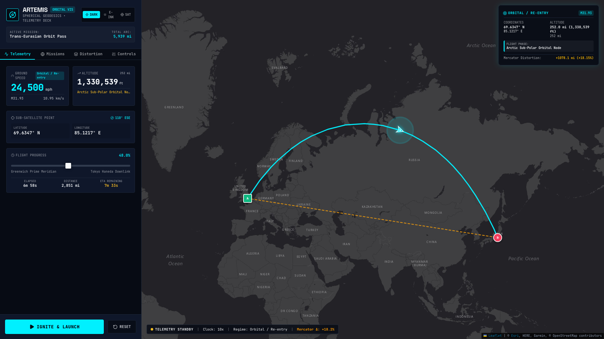
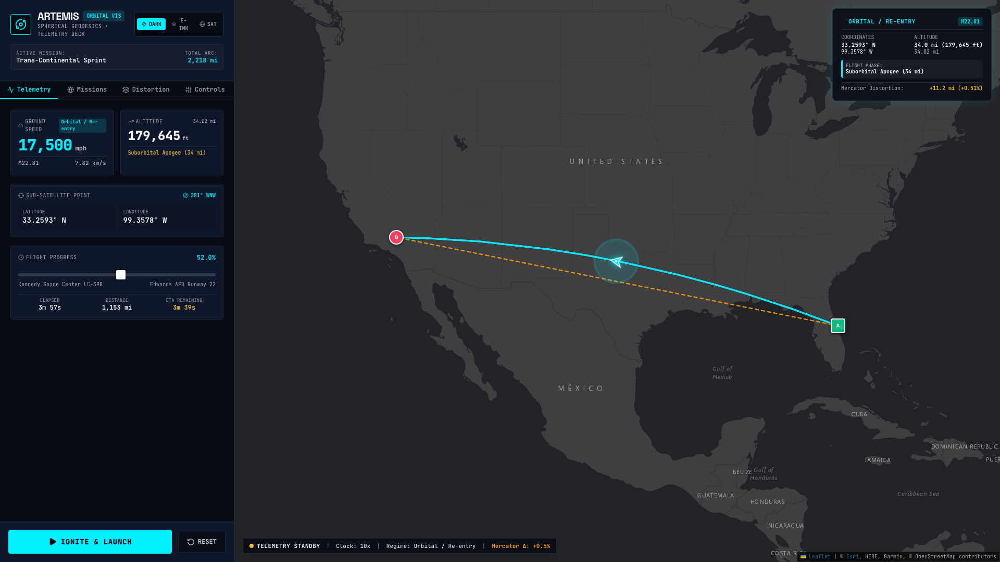
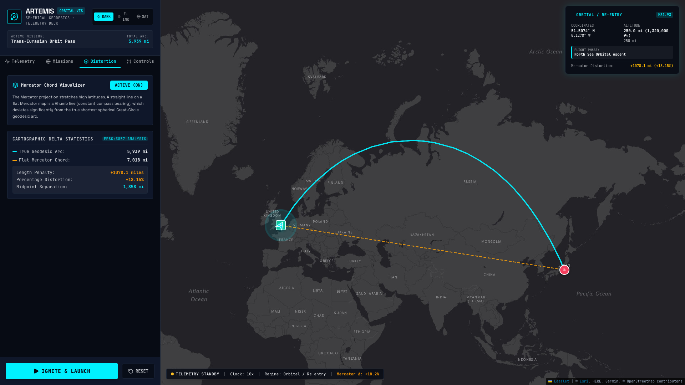

# 🚀 Artemis Velocity Vis



> **Part of the [Cartography Featured Project](https://andrewvoirol.com/work/cartography) on [andrewvoirol.com](https://andrewvoirol.com) • [Live Interactive Lab](https://andrewvoirol.com/lab/artemis)**

An interactive orbital mechanics laboratory and mission control simulator comparing true spherical great-circle geodesics with Web Mercator (EPSG:3857) planar chords at speeds from 500 mph (subsonic cruise) to 25,000 mph (Mach 32.58 atmospheric re-entry).

---

## Showcase Gallery

### 1. Trans-Lunar Re-Entry Telemetry & Skip Entry Profile

*Mach 32.58 atmospheric re-entry corridor from the Central Pacific to San Diego splashdown, tracking altitude through a 400,000 ft Catmull-Rom skip entry profile.*

### 2. Trans-Eurasian Sub-Polar Geodesic Arc

*London to Tokyo orbital pass climbing to 68.99° N near the Arctic Circle, demonstrating how spherical geodesics curve across sub-polar latitudes.*

### 3. NASA Mission Control Dark Telemetry HUD

*Deep obsidian flight deck featuring CartoDB Dark Matter tiles, radar cyan trajectory vectors, amber alerts, and real-time sub-satellite coordinate telemetry.*

### 4. Geodesic Arc vs. Flat Mercator Linear Chord Distortion

*Side-by-side comparison illustrating a +18.15% (+1,078 mile) length distortion and 1,858-mile lateral midpoint separation between the true spherical arc and the flat Mercator chord.*

---

## Quick Start

Requires [Node.js](https://nodejs.org/) 18+.

```bash
git clone https://github.com/AndrewVoirol/artemis-velocity-vis.git
cd artemis-velocity-vis
npm install
npm run dev
```

Open **http://localhost:3000** to launch the flight deck.

---

## How It Works

1. **Choose a Mission Preset**: Select from 4 curated trajectories (Trans-Lunar Skip Entry, Trans-Eurasian Orbit Pass, Trans-Continental Sprint, or Equatorial Geodesic Ring).
2. **Scrub Velocity & Mach**: Drag the velocity slider continuously from 500 mph to 25,000 mph to observe dynamic Mach number readouts and aerospace flight regimes.
3. **Scrub Flight Progress**: Use the bidirectional 0%–100% progress bar to instantly seek to any point along the trajectory, updating sub-satellite coordinates, heading, altitude, and ETA in real time.
4. **Compare Mercator Distortion**: Toggle the Flat Mercator Linear Chord layer to inspect mileage penalties, percentage distortion, and lateral midpoint separation.
5. **Switch Themes**: Toggle between E-Ink Terminal (monochrome paper), NASA Mission Control Dark (obsidian & cyan radar), and Satellite Telemetry Mode (ESRI imagery).
6. **Simulate Real-Time Flight**: Hit **LAUNCH** to engage the kinematic flight engine with smooth camera tracking and continuous time-step integration.

Under the hood, a `requestAnimationFrame` loop drives the simulation clock across a canonical progress parameter $p \in [0, 1]$. Trajectory geometry is computed via 3D spherical vector interpolation (Slerp) on the unit sphere $S^2$ and compared analytically against forward/inverse Web Mercator (EPSG:3857) conformal transformations.

---

## Tech Stack

| Layer | Technology | Purpose |
|---|---|---|
| **Framework** | [Next.js 15](https://nextjs.org/) (App Router) + [React 19](https://react.dev/) | SSR hydration isolation and responsive UI layout |
| **Visualization & GIS** | [Leaflet 1.9](https://leafletjs.com/) + [react-leaflet 5.0](https://react-leaflet.js.org/) | Multi-tile cartography, SVG polylines, and dynamic DivIcon markers |
| **Tile Providers** | OpenStreetMap, CartoDB Dark Matter, ESRI World Imagery | High-contrast E-Ink, Dark HUD, and Satellite base layers |
| **Math & Kinematics** | Native TypeScript Engine (`lib/utils.ts`) | Haversine, 3D Slerp, EPSG:3857, Rhumb integrals, Catmull-Rom splines |
| **Styling** | [Tailwind CSS v4](https://tailwindcss.com/) | Theme tokens, custom sliders, radar ping animations |
| **Icons** | [Lucide React](https://lucide.dev/) | Flight instrument and mission control iconography |
| **Language** | [TypeScript 5](https://www.typescriptlang.org/) | Strict type safety across telemetry states and component interfaces |

---

## Mathematical Derivations

### 1. Haversine Great-Circle Central Angle & Spherical Distance

The shortest path between two points $P_1(\phi_1, \lambda_1)$ and $P_2(\phi_2, \lambda_2)$ on a spherical Earth of mean radius $R = 3,958.8\text{ miles}$ ($6,371.0\text{ km}$) is the minor arc of the great circle formed by the intersection of the sphere with the plane passing through $P_1$, $P_2$, and the geocenter $(0, 0, 0)$.

To prevent numerical loss of significance for small angular separations ($\Delta\sigma \to 0$), the central angle is evaluated using the Haversine identity:

$$\operatorname{hav}(\Delta\sigma) = \operatorname{hav}(\Delta\phi) + \cos\phi_1 \cos\phi_2 \operatorname{hav}(\Delta\lambda)$$

$$\sin^2\left(\frac{\Delta\sigma}{2}\right) = \sin^2\left(\frac{\phi_2 - \phi_1}{2}\right) + \cos\phi_1 \cos\phi_2 \sin^2\left(\frac{\lambda_2 - \lambda_1}{2}\right) \equiv a$$

The central angular distance $\Delta\sigma$ in radians is extracted via the two-argument arctangent:

$$\Delta\sigma = 2 \cdot \operatorname{atan2}\left(\sqrt{a}, \sqrt{1 - a}\right) = 2 \arcsin(\sqrt{a})$$

The surface geodesic distance along the great circle is:

$$D_{\text{geodesic}} = R \cdot \Delta\sigma$$

---

### 2. 3D Spherical Linear Interpolation (Slerp) for Geodesic Waypoints

To compute an intermediate point $P(f)$ at flight progress fraction $f \in [0, 1]$, geographic coordinates are mapped to 3D Cartesian unit vectors $\mathbf{v}_1, \mathbf{v}_2 \in S^2 \subset \mathbb{R}^3$:

$$\mathbf{v}_1 = \begin{pmatrix} \cos\phi_1 \cos\lambda_1 \\ \cos\phi_1 \sin\lambda_1 \\ \sin\phi_1 \end{pmatrix}, \quad \mathbf{v}_2 = \begin{pmatrix} \cos\phi_2 \cos\lambda_2 \\ \cos\phi_2 \sin\lambda_2 \\ \sin\phi_2 \end{pmatrix}$$

The interpolated position vector $\mathbf{v}(f) = (x(f), y(f), z(f))^T$ along the great-circle arc is:

$$\mathbf{v}(f) = \frac{\sin((1 - f)\Delta\sigma)}{\sin\Delta\sigma}\mathbf{v}_1 + \frac{\sin(f\Delta\sigma)}{\sin\Delta\sigma}\mathbf{v}_2$$

Converting $\mathbf{v}(f)$ back to geographic latitude $\phi(f)$ and longitude $\lambda(f)$:

$$\phi(f) = \operatorname{atan2}\left(z(f), \sqrt{x(f)^2 + y(f)^2}\right)$$

$$\lambda(f) = \operatorname{atan2}(y(f), x(f))$$

---

### 3. Web Mercator (EPSG:3857) Projection & Flat Linear Chord

The Web Mercator projection is a conformal cylindrical projection where meridians are equidistant parallel vertical lines and parallels of latitude are horizontal lines spaced to preserve local angles.

#### Forward Projection:
For latitude $\phi \in (-\phi_{\max}, \phi_{\max})$ with $\phi_{\max} = 85.051129^\circ$ and longitude $\lambda \in [-\pi, \pi]$:

$$x = \lambda$$

$$y = \ln\left[\tan\left(\frac{\pi}{4} + \frac{\phi}{2}\right)\right] = \operatorname{gd}^{-1}(\phi) = \frac{1}{2} \ln\left(\frac{1 + \sin\phi}{1 - \sin\phi}\right)$$

#### Flat Linear Interpolation in Mercator Space:
Connecting projected coordinates $(x_1, y_1)$ and $(x_2, y_2)$ via a straight line on the flat map:

$$x(f) = (1 - f) x_1 + f x_2$$

$$y(f) = (1 - f) y_1 + f y_2$$

#### Inverse Projection:
Converting planar $(x(f), y(f))$ back to spherical latitude $\phi(f)$ and longitude $\lambda(f)$:

$$\lambda(f) = x(f)$$

$$\phi(f) = 2 \arctan\left(\exp(y(f))\right) - \frac{\pi}{2} = \operatorname{gd}(y(f))$$

Because the Mercator projection is conformal and meridians are parallel vertical lines, a straight line on the flat projection maintains a constant compass heading with every meridian:

$$\frac{dy}{dx} = \text{constant} = \cot\alpha$$

Thus, the flat Mercator linear chord is mathematically identical to a **Rhumb line (loxodrome)** on the physical globe.

---

### 4. Cartographic Distortion Quantification

The surface distance $D_{\text{mercator}}$ along the flat linear chord is evaluated via closed-form Rhumb line integration:

$$\Delta\phi = \phi_2 - \phi_1, \quad \Delta y = y_2 - y_1$$

$$q = \begin{cases} \dfrac{\Delta\phi}{\Delta y}, & \text{if } |\Delta\phi| \ge 10^{-12} \\ \cos\phi_1, & \text{if } |\Delta\phi| < 10^{-12} \end{cases}$$

$$D_{\text{mercator}} = R \sqrt{(\Delta\phi)^2 + q^2 (\Delta\lambda)^2}$$

#### Distortion Metrics:
- **Absolute Distance Delta**: $\Delta D = D_{\text{mercator}} - D_{\text{geodesic}} \ge 0$
- **Percentage Distortion**: $\%_{\text{distortion}} = \left(\frac{D_{\text{mercator}} - D_{\text{geodesic}}}{D_{\text{geodesic}}}\right) \times 100\%$
- **Lateral Midpoint Separation**: Physical surface distance between $\mathbf{M}_{\text{geo}} = P_{\text{geo}}(0.5)$ and $\mathbf{M}_{\text{merc}} = P_{\text{merc}}(0.5)$.

#### Empirical Benchmark Table across Mission Presets:

| Mission Preset | Geodesic Distance | Flat Mercator Distance | Delta ($\Delta D$) | Distortion % | Midpoint Separation | Peak Latitude |
|---|---|---|---|---|---|---|
| **Trans-Lunar Return & Skip Entry**<br>`[12.0°N, -170.0°W]` $\to$ `[32.72°N, -117.16°W]` | **3,623.77 mi** | **3,644.49 mi** | **+20.72 mi** | **+0.57%** | **188.74 mi** | 32.72° N |
| **Trans-Eurasian Orbit Pass**<br>`[51.51°N, -0.13°W]` $\to$ `[35.68°N, 139.65°E]` | **5,939.48 mi** | **7,017.56 mi** | **+1,078.08 mi** | **+18.15%** | **1,857.57 mi** | **68.99° N** |
| **Trans-Continental Sprint**<br>`[28.57°N, -80.65°W]` $\to$ `[34.91°N, -117.88°W]` | **2,218.14 mi** | **2,229.35 mi** | **+11.20 mi** | **+0.51%** | **100.14 mi** | 35.88° N |
| **Equatorial Geodesic Ring**<br>`[-3.07°S, 37.36°E]` $\to$ `[-0.74°S, -90.31°W]` | **8,812.91 mi** | **8,816.99 mi** | **+4.08 mi** | **+0.05%** | **166.49 mi** | -4.31° S |

---

### 5. Aerospace Velocity Kinematics & Mach Number Telemetry

- **Speed of Sound Reference**: $c_0 = 767.26\text{ mph}$ ($343.0\text{ m/s} = 1,125.33\text{ ft/s}$) at standard sea level ($15^\circ\text{C}$, $101.325\text{ kPa}$).
- **Dynamic Mach Number**:
  $$M = \frac{v}{767.26\text{ mph}}$$
- **Ground-Track Velocity Vectors**:
  $$v_{\text{mps}} = \frac{v_{\text{mph}}}{3600} \quad (\text{mi/s}), \quad v_{\text{km/s}} = v_{\text{mph}} \times 0.00044704, \quad v_{\text{knots}} = v_{\text{mph}} \times 0.868976$$
- **Continuous Flight Time Integration**:
  $$T_{\text{total}} = \frac{D_{\text{geodesic}}}{v_{\text{mps}}}, \quad t_{\text{elapsed}} = p \cdot T_{\text{total}}, \quad \text{ETA} = (1 - p) \cdot T_{\text{total}}$$
- **Atmospheric Skip Entry Altitude Profile (Catmull-Rom Spline)**:
  For the Artemis re-entry corridor, altitude $h(p)$ is evaluated across 7 boundary nodes:
  $$p \in \{0.0 \to 400\text{k ft}, \, 0.25 \to 210\text{k ft}, \, 0.50 \to 290\text{k ft}, \, 0.75 \to 140\text{k ft}, \, 0.90 \to 45\text{k ft}, \, 0.96 \to 12\text{k ft}, \, 1.0 \to 0\text{ ft}\}$$

---

## Standalone Component Usage

The flight simulator is exported as a self-contained, zero-side-effect React component (`components/ArtemisFlightSimulator.tsx`) ready for drop-in inclusion in host web applications.

### Props Interface

```typescript
export interface ArtemisFlightSimulatorProps {
  /** Initial preset mission ('lunar-return' | 'trans-eurasian' | 'trans-continental' | 'equatorial-ring') */
  initialPreset?: 'lunar-return' | 'trans-eurasian' | 'trans-continental' | 'equatorial-ring';
  /** Initial UI theme ('nasa-dark' | 'e-ink' | 'satellite') */
  initialTheme?: 'nasa-dark' | 'e-ink' | 'satellite';
  /** Initial ground-track velocity in mph (500 to 25,000) */
  initialVelocityMph?: number;
  /** Whether the Mercator linear chord comparison layer is visible on mount */
  showMercatorDefault?: boolean;
  /** Custom wrapper CSS classes */
  className?: string;
  /** Compact widget layout mode for embedded cards */
  compact?: boolean;
  /** Streaming telemetry callback for host dashboards */
  onTelemetryUpdate?: (telemetry: TelemetryData) => void;
}
```

### Drop-In Example

```tsx
import ArtemisFlightSimulator from '@/components/ArtemisFlightSimulator';

export default function MissionControlPage() {
  return (
    <main className="w-full h-screen">
      <ArtemisFlightSimulator
        initialPreset="trans-eurasian"
        initialTheme="nasa-dark"
        initialVelocityMph={24500}
        showMercatorDefault={true}
        onTelemetryUpdate={(data) => {
          console.log(`Current Mach: ${data.machStr}, Heading: ${data.headingStr}`);
        }}
      />
    </main>
  );
}
```

---

## License

[MIT](LICENSE) &copy; Andrew Voirol
