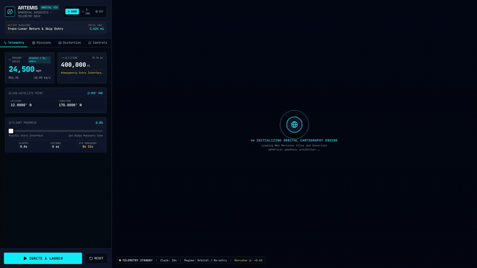
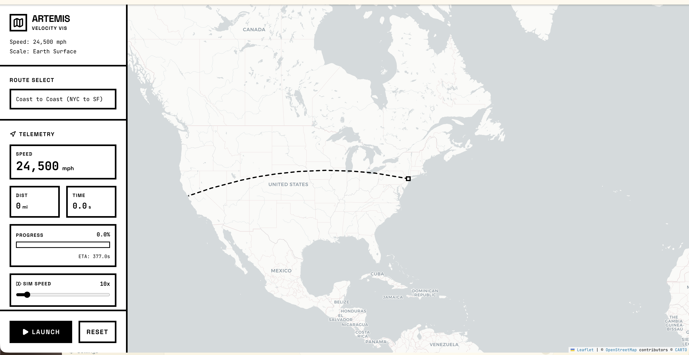
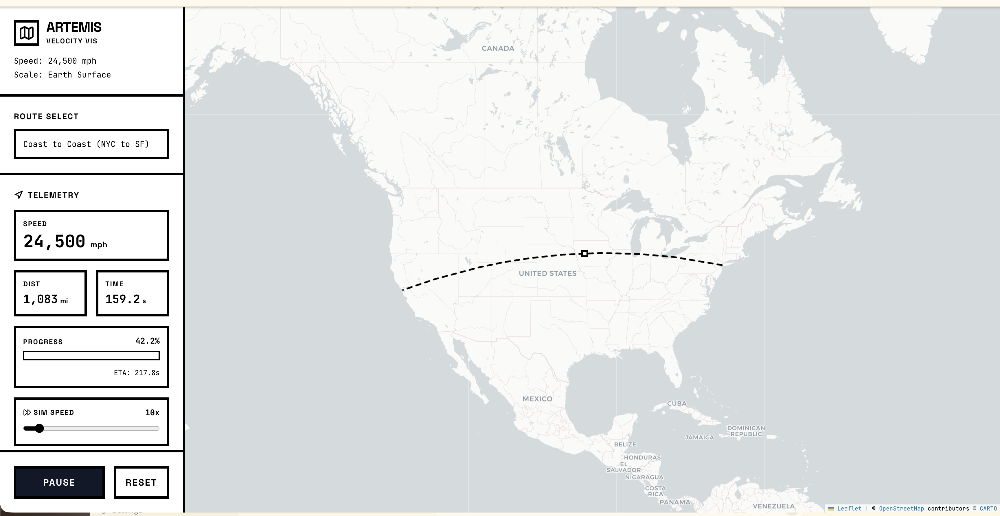
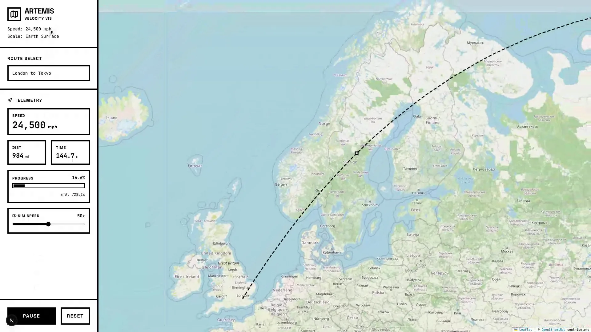

# 🚀 Artemis Velocity Vis



An interactive visualization that puts NASA's Artemis II re-entry speed into perspective by simulating the spacecraft traveling between real locations on Earth.

**How fast is 24,500 mph?** Launch the simulation and find out — the spacecraft crosses the continental United States in about 6 minutes.

---

## Features

- **Geodesic trajectories** — routes follow true great-circle arcs via spherical intermediate interpolation, not flat map projections
- **Live camera tracking** — the viewport pans dynamically to follow the spacecraft marker in flight
- **Real-time telemetry HUD** — distance covered, elapsed time, live ETA, and progress bar update continuously
- **Adjustable simulation speed** — 1× to 100× time multiplier so you can watch at your own pace
- **Multi-route presets** — Coast-to-Coast (NYC → SF) and Transcontinental (London → Tokyo)

### Coast to Coast (NYC → San Francisco)



### In-Flight Telemetry & Dynamic Tracking



### Transcontinental Route (London → Tokyo)



---

## Quick Start

You need [Node.js](https://nodejs.org/) (v18+).

```bash
git clone https://github.com/AndrewVoirol/artemis-velocity-vis.git
cd artemis-velocity-vis
npm install
npm run dev
```

Open **http://localhost:3000** — that's it.

---

## How It Works

1. Pick a route from the dropdown (or stick with the default NYC → SF)
2. Hit **LAUNCH**
3. Watch the spacecraft marker fly along the great-circle arc while telemetry updates live
4. Drag the **Sim Speed** slider to speed things up or slow them down
5. Hit **PAUSE** to freeze, **RESET** to start over

Under the hood, the app computes the [Haversine distance](https://en.wikipedia.org/wiki/Haversine_formula) between coordinate pairs, then animates the spacecraft along the [great-circle path](https://en.wikipedia.org/wiki/Great-circle_distance) at 24,500 mph (6.81 mi/s) using spherical intermediate interpolation. A `requestAnimationFrame` loop drives the simulation clock with sub-millisecond precision.

---

## Tech Stack

| Layer | Technology |
|-------|-----------|
| Framework | [Next.js 15](https://nextjs.org/) + [React 19](https://react.dev/) |
| Map | [Leaflet](https://leafletjs.com/) via [react-leaflet](https://react-leaflet.js.org/) |
| Styling | [Tailwind CSS v4](https://tailwindcss.com/) |
| Icons | [Lucide React](https://lucide.dev/) |
| Language | [TypeScript](https://www.typescriptlang.org/) |

---

## License

[MIT](LICENSE) — Andrew Voirol

